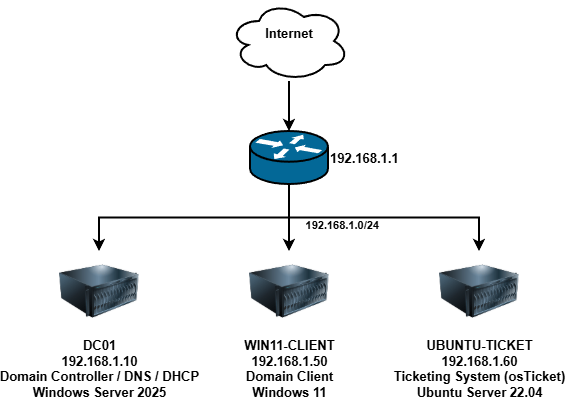

# Homelab - IT Infrastructure Project

## Overview
A virtualised IT infrastructure environment built to simulate a real-world business network. 
Designed to develop and demonstrate hands-on skills in Active Directory, networking, 
Group Policy, and helpdesk ticketing systems.

## Environment
| Hostname | OS | Role | IP |
|---|---|---|---|
| DC01 | Windows Server 2025 | Domain Controller / DNS / DHCP | 192.168.1.10 |
| WIN11-CLIENT | Windows 11 | Domain Client | 192.168.1.50 |
| UBUNTU-TICKET | Ubuntu Server 22.04 | Ticketing System (osTicket) | 192.168.1.101 |

## Network Diagram

## What Was Built

### Active Directory
- Deployed Active Directory Domain Services on Windows Server 2025
- Created domain: homelab.local
- Configured 4 Organisational Units: IT, HR, Finance, Sales
- Created 8 domain user accounts across all OUs
- Created security groups per department and assigned users

### DNS & DHCP
- Configured DNS forward and reverse lookup zones on DC01
- Created DHCP scope: 192.168.1.100 - 192.168.1.200
- Configured default gateway and DNS options on DHCP scope

### Group Policy
- Password Policy: 10 character minimum, complexity enabled, 90 day expiry
- Account Lockout Policy: locks after 5 failed attempts, 30 minute duration
- USB Lockdown: all removable storage disabled via GPO
- Desktop Wallpaper: enforced via GPO on IT OU
- Verified all GPOs applying correctly on WIN11-CLIENT using gpresult /r

### osTicket
- Deployed LAMP stack on Ubuntu Server 22.04
- Installed and configured osTicket v1.18.1
- Created departments: IT Support, Network, Hardware
- Created help topics: Password Reset, Software Issue, Hardware Issue, 
  Network Connectivity, New User Setup
- Created agents and practised ticket triage, assignment, and resolution

## Skills Demonstrated
- Active Directory administration
- DNS and DHCP configuration
- Group Policy creation and verification
- Windows Server 2025 deployment
- Linux server administration (Ubuntu)
- Helpdesk ticketing system administration
- Network design and documentation
